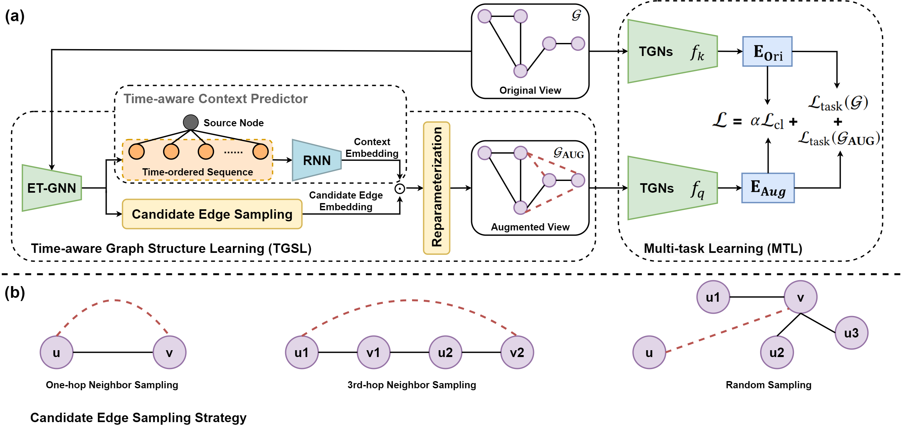

# Time-aware Graph Structure Learning via Sequence Prediction on Temporal Graphs


Official implementation of the CIKM'23 Full/Long paper: Time-aware Graph Structure Learning via Sequence Prediction on Temporal Graphs. [[arXiv](https://arxiv.org/abs/2306.07699)]





## Environment Setup

```bash
# python==3.8
pip install torch==1.10.1+cu113 torchvision==0.11.2+cu113 torchaudio==0.10.1 -f https://download.pytorch.org/whl/cu113/torch_stable.html
pip install dgl==1.0.0+cu113 -f https://data.dgl.ai/wheels/cu113/repo.html
pip install scikit-learn
```


## TGAT + TGSL

For TGAT, we use the official implementation codes: [TGAT](https://github.com/StatsDLMathsRecomSys/Inductive-representation-learning-on-temporal-graphs)

### Datasets & Pre-processing

Download the Wikipedia and Reddit datasets from [here](http://snap.stanford.edu/jodie/) and Escorts from [here](https://networkrepository.com/escorts.php). Save the downloaded files in the `data/` folder.


Run the following commands to pre-process datasets.

```bash
# wikipedia
python process.py --dataset wikipedia
# reddit
python process.py --dataset reddit
# escorts
python process.py --dataset escorts
```


### Training & Evaluation

Run the following commands to start training and evaluation.

```bash
# wikipedia
python train.py --dataset wikipedia --uniform --agg_method attn --attn_mode prod --cuda 0 --prefix tgat_tgsl_wiki --seed 2023 --tau 0.1 --ratio 0.8 --can_type 1st --can_nn 10 --rnn_layer 3 --coe 0.2 --K 512 --gtau 1.0
# reddit
python train.py --dataset reddit --uniform --agg_method attn --attn_mode prod --cuda 0 --prefix tgat_tgsl_reddit --seed 2023 --tau 0.1 --ratio 0.4 --can_type 1st --can_nn 20 --rnn_layer 1 --coe 0.2 --K 512 --gtau 1.0
# escorts
python train.py --dataset escorts --uniform --agg_method attn --attn_mode prod --cuda 0 --prefix tgat_tgsl_escorts --seed 2023 --tau 0.1 --ratio 0.064 --can_type 3rd --can_nn 5 --rnn_layer 1 --coe 0.7 --K 512 --gtau 1.0
```


## GraphMixer + TGSL

For GraphMixer, we use [DyGLib](https://github.com/yule-BUAA/DyGLib) to implement TGSL under both transductive and inductive settings. 

GraphMixer official implementation: [GraphMixer](https://github.com/CongWeilin/GraphMixer)

### Datasets & Pre-processing

The same as TGAT + TGSL.


### Training & Evaluation

Run the following commands to start training and evaluation.


```bash
# wikipedia
python train_link_prediction.py --dataset_name wikipedia --prefix graphmixer_tgsl_wiki --log_name graphmixer_tgsl_wiki --model_name GraphMixer --load_best_configs --num_runs 1 --gpu 0 --tau 0.1 --ratio 0.008 --can_nn 10 --can_type 3rd --rnn_layer 1 --coe 0.2 --K 512 --gtau 1.0
# reddit
python train_link_prediction.py --dataset_name reddit --prefix graphmixer_tgsl_reddit --log_name graphmixer_tgsl_reddit --model_name GraphMixer --load_best_configs --num_runs 1 --gpu 0 --tau 0.1 --ratio 0.4 --can_nn 20 --can_type 1st --rnn_layer 2 --coe 0.2 --K 512 --gtau 1.0
# escorts
python train_link_prediction.py --dataset_name escorts --prefix graphmixer_tgsl_escorts --log_name graphmixer_tgsl_escorts --model_name GraphMixer --load_best_configs --num_runs 1 --gpu 0 --tau 0.1 --ratio 0.002 --can_nn 20 --can_type 3rd --rnn_layer 1 --coe 0.2 --K 512 --gtau 1.0
```


## Acknowledgments

Thanks to the publicly released codes of [TGAT](https://github.com/StatsDLMathsRecomSys/Inductive-representation-learning-on-temporal-graphs) and [DyGLib](https://github.com/yule-BUAA/DyGLib), we implement TGSL based on them. 


## Citation

```bibtex
@article{TGSL,
  title={Time-aware Graph Structure Learning via Sequence Prediction on Temporal Graphs},
  author={Haozhen Zhang and Xueting Han* and Xi Xiao and Jing Bai},
  journal={arXiv preprint arXiv:2306.07699},
  year={2023}
}
```
